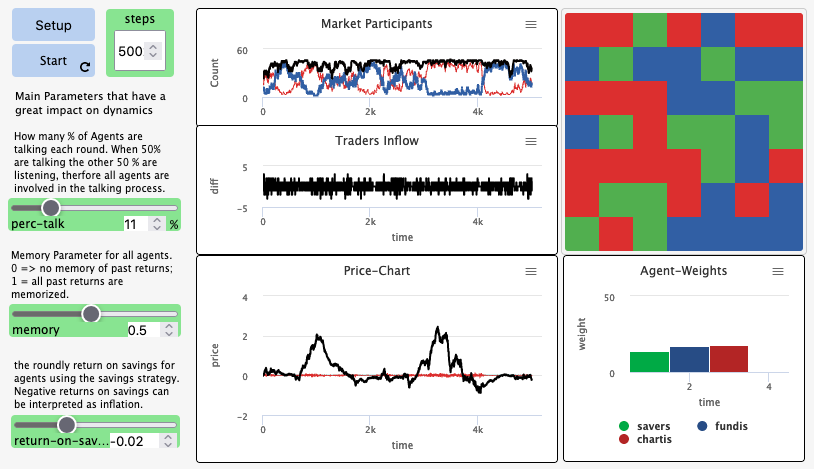

# Markets Inflow Dynamics - an Agent-Based Model in NetLogo

Explore, understand, and contribute to a comprehensive model simulating financial markets.

Get a hands-on feel of the model through our interactive [Web Model](web-model.html). 

Conduct some Experiments ???

## Documentation

For People who want to use the model

- [Qick Start Guide](QuickStartGuide.md)
- [Web Model](web-model.html)

For People who want to understand its internals

- [ReadMe](ReadMe_doc.md)
- [Documentation](Documentation.md)
- [Understanding the Model]()

## The Models

- [Web Model](web-model.html)
- [Simple NetLogo Model](relative/path/to/simple/model.nlogo) - A foundational representation.
- [Complex NetLogo Model](relative/path/to/complex/model.nlogo) - Advanced model with parameter settings and data export features.

## Analytical Insights

Examine the financial time series used for calibrating the model

- [Reference Asset](Bitcoin-Timeseries)

## Resources and Guides

- [NetLogo Documentation](https://ccl.northwestern.edu/netlogo/docs/)
- [NetLogo Installation Guide](https://ccl.northwestern.edu/netlogo/download.shtml)
